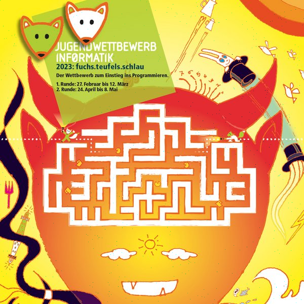
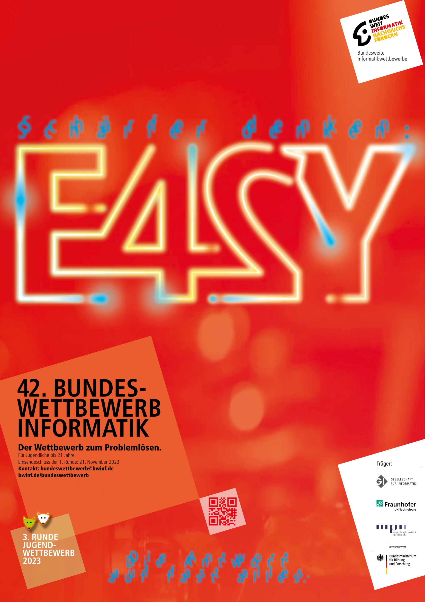

# Junioraufgabe 2 - St. Egano

Dokumentation und Programmcode von Simon Reilich

## Lösungsidee

Um auf die RGB-Werte der einzelnen Pixel zugreifen zu können, wird eine geeignete Datenstruktur benötigt. Des weiteren muss der Integer-Wert noch in die drei Bestandteile rot, grün und blau zerlegt werden. Die Dekodierung der Nachricht ist in der Aufgabenstellung bereits erklärt.

## Umsetzung

Die Lösungs-Idee wird in Java implementiert, der Name der zu entschlüsselnden Bilddatei wird dem Programm beim Start im Terminal übergeben, sollte die Eingabe fehlerhaft sein, wird eine `IllegalArgumentException` bzw. `IIOException` geworfen und das Programm bricht ab.

Zur Repräsentation des Bildes wird die Klasse `BufferedImage` verwendet, zur Zerlegung des RGB-Werts die Klasse `Color`, beide aus der Standartbibliothek von Java.

```java
BufferedImage image = ImageIO.read(new File(args[0]));

StringBuilder sb = new StringBuilder();

int x = 0;
int y = 0;
Color color;

do {
  color = new Color(image.getRGB(x, y));
  sb.append((char) color.getRed());
  x += color.getGreen();
  y += color.getBlue();
  x %= image.getWidth();
  y %= image.getHeight();
} while (color.getGreen() != 0 && color.getBlue() != 0);
```

Zuerst werden das `BufferedImage` und ein `StringBuilder`, für die Konstruktion der Nachricht, erstellt. 

In der folgenden do-while-Schleife wird zuerst der RGB-Wert des aktuellen Pixels (es wird bei 0, 0 gestartet) gelesen und in `color` gespeichert. Da die Nachricht in ASCII codiert ist, wird der rot-Wert einfach mittels `.getRed()` ausgelesen, zu einem `char` gecastet und an den `StringBuilder` angehängt. Darauf folgt die Berechnung der nächsten Position: Es wird um den grün-Wert nach rechts, und um den blau-Wert nach unten verschoben. Um sicherzustellen, das die neuen Koordinaten noch in-bounds sind, werden die beiden Werte noch einmal Modulo die Breite/Höhe des Bilds gerechnet. Diese Schritte werden solange wiederholt, bis der grün- und der blau-Wert beide null sind.

Zum Schluss wird noch die entschlüsselte Nachricht auf der Konsole ausgegeben.

## Beispiele

Beispiel 1:


<aside>
📤 Ausgabe:

Hallo Welt

</aside>

Beispiel 2:


<aside>
📤 Ausgabe:

Hallo Gloria

Wie treffen uns am Freitag um 15:00 Uhr vor der Eisdiele am Markplatz.

Alle Liebe,
Juliane

</aside>

Beispiel 3:


<aside>
📤 Ausgabe:

Hallo Juliane,

Super, ich werde da sein! Ich freue mich schon auf den riesen Eisbecher mit Erdbeeren.

Bis bald,
Gloria

</aside>

Beispiel 4:



<aside>
📤 Ausgabe:

Der Jugendwettbewerb Informatik ist ein Programmierwettbewerb für alle, die erste Programmiererfahrungen sammeln und vertiefen möchten. Programmiert wird mit Blockly, einer Bausteinorientierten Programmiersprache. Vorkenntnisse sind nicht nötig. Um sich mit den Aufgaben des Wettbewerbs vertraut zu machen, empfehlen wir unsere Trainingsseite . Er richtet sich an Schülerinnen und Schüler der Jahrgangsstufen 5 - 13, prinzipiell ist aber eine Teilnahme ab Jahrgangsstufe 3 möglich. Der Wettbewerb besteht aus drei Runden. Die ersten beiden Runden erfolgen online. In der 3. Runde werden zwei Aufgaben gestellt, diese gilt es mit eigenen Programmierwerkzeugen zuhause zu bearbeiten.

</aside>

Beispiel 5:



<aside>
📤 Ausgabe:

Der Bundeswettbewerb Informatik richtet sich an Jugendliche bis 21 Jahre, vor dem Studium oder einer Berufstätigkeit. Der Wettbewerb beginnt am 1. September, dauert etwa ein Jahr und besteht aus drei Runden. Dabei können die Aufgaben der 1. Runde ohne größere Informatikkenntnisse gelöst werden; die Aufgaben der 2. Runde sind deutlich schwieriger.

Der Bundeswettbewerb ist fachlich so anspruchsvoll, dass die Gewinner i.d.R. in die Studienstiftung des deutschen Volkes aufgenommen werden. Aus den Besten werden die TeilnehmerInnen für die Internationale Informatik-Olympiade ermittelt. Der Bundeswettbewerb ermöglicht den Teilnehmenden, ihr Wissen zu vertiefen und ihre Begabung weiterzuentwickeln. So trägt der Wettbewerb dazu bei, Jugendliche mit besonderem fachlichen Potenzial zu erkennen.

</aside>

Beispiel 6:


<aside>
📤 Ausgabe: 
Bonn

Die Bundesstadt Bonn (im Latein der Humanisten Bonna) ist eine kreisfreie Großstadt im Regierungsbezirk Köln im Süden des Landes Nordrhein-Westfalen und Zweitregierungssitz der Bundesrepublik Deutschland. Mit 336.465 Einwohnern (31. Dezember 2022) zählt Bonn zu den zwanzig größten Städten Deutschlands. …

(der Übersichtlichkeit wegen werden hier nur die ersten / letzten ~300 Zeichen angegeben)

… Gemäß dem Berlin/Bonn-Gesetz behält das Bundesjustizministerium weiterhin eine Außenstelle mit etwa 30 Mitarbeitern in Bonn.

Arbeitsmarktbehörden
Bonn ist außerdem Standort der Zentralen Auslands- und Fachvermittlung (ZAV) der Bundesagentur für Arbeit (BA). Im Stadtteil Duisdorf befindet sich der Hauptsitz der ZAV mit ihren bundesweit 18 Standorten.

Quelle: [https://de.wikipedia.org/wiki/Bonn](https://de.wikipedia.org/wiki/Bonn)

</aside>

Beispiel 7:


<aside>
📤 Ausgabe:

Es hatte ein Mann einen Esel, der schon lange Jahre die Säcke unverdrossen zur Mühle getragen hatte, dessen Kräfte aber nun zu Ende giengen, so daß er zur Arbeit immer untauglicher ward. Da dachte der Herr daran, ihn aus dem Futter zu schaffen, aber der Esel merkte daß kein guter Wind wehte, lief fort und machte sich auf den Weg nach Bremen: …

(der Übersichtlichkeit wegen werden hier nur die ersten / letzten ~300 Zeichen angegeben)

… und oben auf dem Dache, da sitzt der Richter, der rief bringt mir den Schelm her. Da machte ich daß ich fortkam." Von nun an getrauten sich die Räuber nicht weiter in das Haus, den vier Bremer Musikanten gefiels aber so wohl darin, daß sie nicht wieder heraus wollten. Und der das zuletzt erzählt hat, dem ist der Mund noch warm.
end

</aside>
